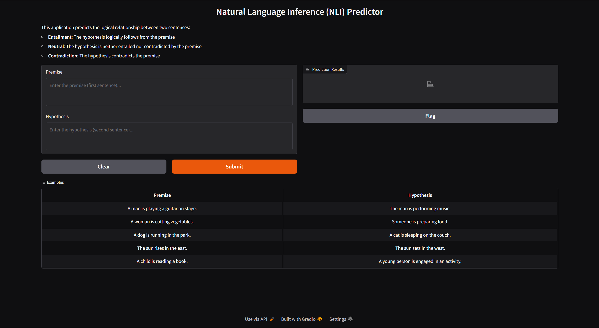
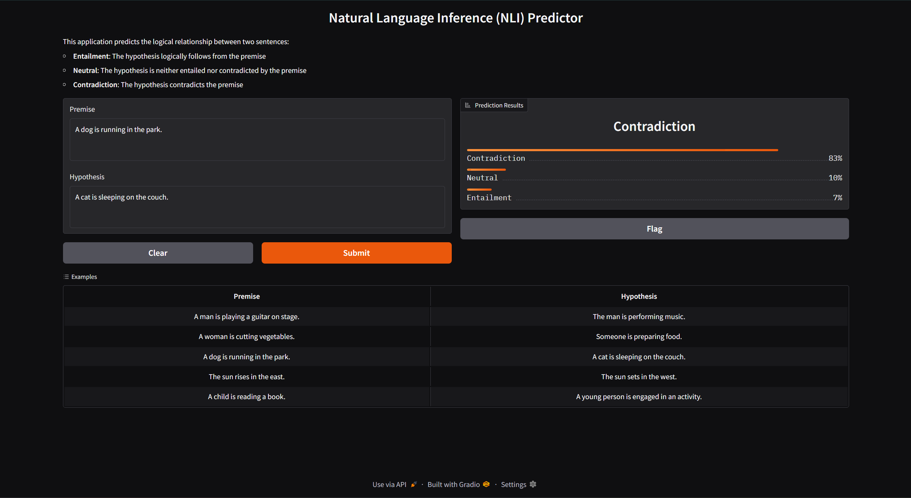
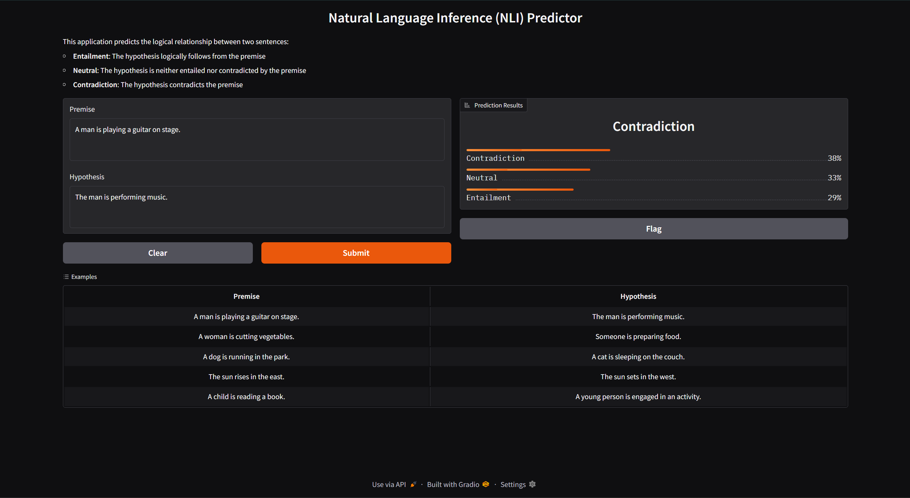
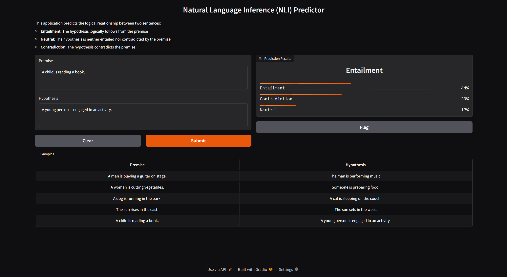

# NLU Assignment 4 - BERT from Scratch, Sentence-BERT Fine-tuning

**Name:** Muhammad Fahad Waqar<br>
**Student ID:** st125981

---

## Assignment Overview

This assignment implements a BERT model from scratch, fine-tunes it as Sentence-BERT for Natural Language Inference (NLI) classification, evaluates its performance on the SNLI dataset, and develops an interactive web application for NLI predictions.

---

## Task 1: Train BERT from Scratch

### 1.1 Implementation Details

**Objective:** Implement and train a BERT model from scratch using the Masked Language Modeling (MLM) and Next Sentence Prediction (NSP) objectives.

**Model Architecture:**

- **Encoder Layers:** 6 transformer encoder layers
- **Attention Heads:** 8 multi-head attention heads per layer
- **Hidden Dimension (d_model):** 768
- **Feed-Forward Dimension (d_ff):** 3,072 (768 × 4)
- **Attention Dimension (d_k, d_v):** 64
- **Maximum Sequence Length:** 256 tokens
- **Vocabulary Size:** 103,620 words (extracted from WikiText-103)
- **Total Parameters:** 118,871,750

**Key Components Implemented:**

1. **Embedding Layer:** Token embeddings + Positional embeddings + Segment embeddings with LayerNorm
2. **Scaled Dot-Product Attention:** Attention mechanism with masking
3. **Multi-Head Attention:** 8 parallel attention heads
4. **Position-wise Feed-Forward Network:** Two-layer FFN with GELU activation
5. **Encoder Layer:** Self-attention + FFN with residual connections
6. **BERT Model:** Complete architecture with MLM and NSP heads

### 1.2 Training Configuration

**Dataset:** WikiText-103 (wikitext-103-raw-v1)
- **Source:** HuggingFace Datasets
- **Training Samples:** 100,000 sentences
- **Preprocessing:** Sentence segmentation using spaCy, vocabulary building, masking strategy

**Hyperparameters:**

| Parameter | Value |
|-----------|-------|
| Batch Size | 32 |
| Learning Rate | 1e-4 |
| Optimizer | Adam |
| Epochs | 3 |
| Masking Ratio | 15% |
| Masking Strategy | 80% [MASK], 10% random, 10% unchanged |
| Max Sequence Length | 256 |
| Device | CUDA (GPU) |

### 1.3 Training Results

**Training Progress:**

| Epoch | Total Loss | MLM Loss | NSP Loss |
|-------|------------|----------|----------|
| 1     | 5.8718     | 5.1744   | 0.6974   |
| 2     | 3.2234     | 2.5280   | 0.6954   |
| 3     | 2.9875     | 2.2926   | 0.6949   |

**Analysis:**
- The model shows consistent improvement across all epochs
- Total loss decreased by 49.2% from epoch 1 to epoch 3 (5.87 → 2.99)
- MLM loss converged well, decreasing from 5.17 to 2.29
- NSP loss remained stable around 0.69, indicating effective next sentence prediction learning
- Both pretraining objectives (MLM and NSP) converged successfully

**Model Artifacts:**
- `bert_scratch.pth` - Trained BERT model weights
- `vocab.json` - Vocabulary dictionary (103,620 words)
- `bert_config.json` - Model configuration

---

## Task 2: Fine-tune Sentence-BERT for NLI

### 2.1 Implementation Details

**Objective:** Fine-tune the pretrained BERT model as Sentence-BERT for Natural Language Inference classification on the SNLI dataset.

**Sentence-BERT Architecture:**

1. **BERT Encoder:** Pretrained BERT from Task 1 (weights loaded)
2. **Mean Pooling:** Average token embeddings across sequence length
3. **Sentence Representation:** Generate embeddings u (premise) and v (hypothesis)
4. **Concatenation Strategy:** [u, v, |u-v|] - concatenate premise, hypothesis, and element-wise difference
5. **Classification Head:** Linear layer (2304 → 3 classes)

**Siamese Network Structure:**
- Shared BERT encoder processes both premise and hypothesis
- Produces fixed-size sentence embeddings via mean pooling
- Concatenated representation captures semantic relationship

### 2.2 Training Configuration

**Dataset:** Stanford Natural Language Inference (SNLI)
- **Source:** HuggingFace Datasets (stanfordnlp/snli)
- **Training Samples:** ~10,000 (subset for faster training)
- **Validation Samples:** ~1,000
- **Test Samples:** ~1,000
- **Labels:** 0=Entailment, 1=Neutral, 2=Contradiction

**Hyperparameters:**

| Parameter | Value |
|-----------|-------|
| Batch Size | 32 |
| Learning Rate (BERT) | 2e-5 |
| Learning Rate (Classifier) | 2e-5 |
| Optimizer | Adam (separate for encoder and classifier) |
| Epochs | 3 |
| Max Sequence Length | 128 |
| Warmup Ratio | 10% |
| Loss Function | CrossEntropyLoss |

### 2.3 Training Results

**Training Progress:**

| Epoch | Train Loss | Train Accuracy | Validation Accuracy |
|-------|------------|----------------|---------------------|
| 1     | 1.1005     | 34.37%         | 30.40%              |
| 2     | 1.0861     | 37.73%         | 37.90%              |
| 3     | 1.0726     | 39.58%         | 40.50%              |

**Analysis:**
- Steady improvement in both training and validation accuracy
- Final validation accuracy: 40.50%
- Training loss decreased consistently from 1.10 to 1.07
- No significant overfitting observed (train and validation accuracies track closely)

**Model Artifacts:**
- `sbert_encoder.pth` - Fine-tuned BERT encoder weights
- `sbert_classifier.pth` - Trained classification head weights

---

## Task 3: Evaluation and Analysis

### 3.1 Performance Metrics - Classification Report

**Test Set Performance (1,000 samples):**

**Classification Report:**

| Class         | Precision | Recall | F1-Score | Support |
|---------------|-----------|--------|----------|---------|
| Entailment    | 0.48      | 0.32   | 0.38     | 334     |
| Neutral       | 0.41      | 0.67   | 0.51     | 336     |
| Contradiction | 0.35      | 0.24   | 0.29     | 330     |
| **Accuracy**  |           |        | **0.41** | **1000** |
| **Macro Avg** | **0.41**  | **0.41** | **0.39** | **1000** |
| **Weighted Avg** | **0.41** | **0.41** | **0.39** | **1000** |

### 3.2 Detailed Performance Analysis

**Overall Performance:**
- **Test Accuracy:** 41.00%
- **Total Test Samples:** 1,000
- **Correctly Classified:** 410
- **Misclassified:** 590

**Per-Class Performance:**

| Class | Accuracy | Correct | Incorrect |
|-------|----------|---------|-----------|
| Entailment | 31.74% | 106 / 334 | 228 |
| Neutral | 66.96% | 225 / 336 | 111 |
| Contradiction | 24.24% | 80 / 330 | 250 |

**Confusion Matrix:**

|               | Predicted Entailment | Predicted Neutral | Predicted Contradiction |
|---------------|---------------------|-------------------|------------------------|
| **True Entailment**    | 106                 | 143               | 85                     |
| **True Neutral**       | 48                  | 225               | 63                     |
| **True Contradiction** | 68                  | 182               | 80                     |

### 3.3 Key Observations

1. **Neutral Class Performance:** The model performs best on the Neutral class with 66.96% accuracy and recall of 0.67, suggesting it effectively learned to identify ambiguous relationships.

2. **Entailment Confusion:** True entailment samples are frequently misclassified as neutral (143 out of 334 cases), indicating difficulty distinguishing logical implication from ambiguity.

3. **Contradiction Challenges:** The Contradiction class has the lowest accuracy (24.24%) with 182 cases misclassified as neutral, showing the model struggles with identifying direct contradictions.

4. **Bias Toward Neutral:** The model exhibits a strong bias toward predicting "neutral" for uncertain cases, which is the most frequent prediction error across all classes.

### 3.4 Error Analysis

**Example Misclassifications:**

*Example 1 - Contradiction predicted as Entailment:*
- **Premise:** "One female and two male musicians holding musical equipment."
- **Hypothesis:** "There four females"
- **True Label:** Contradiction
- **Predicted:** Entailment (confidence: 48.9%)
- **Analysis:** Model failed to recognize numerical mismatch and gender contradiction

*Example 2 - Entailment predicted as Neutral:*
- **Premise:** "A man in a red sweatshirt pushes a giant redwood tree in a snowy forest."
- **Hypothesis:** "A man pushes a redwood tree in the forest."
- **True Label:** Entailment
- **Predicted:** Neutral (confidence: 37.2%)
- **Analysis:** Model overly cautious about removing descriptive details (red sweatshirt, giant, snowy)

*Example 3 - Contradiction predicted as Entailment:*
- **Premise:** "Five children, two boys and three girls, with the girls wearing white scarves, sit on the pavement outside."
- **Hypothesis:** "They are wearing swimsuits."
- **True Label:** Contradiction
- **Predicted:** Entailment (confidence: 55.1%)
- **Analysis:** Model failed to recognize clothing contradiction (white scarves vs. swimsuits)

### 3.5 Limitations and Challenges Encountered

**1. Limited Pretraining Data:**
- Used only 100,000 samples (~199,177 sentences) from WikiText-103
- BERT's original training corpus: 3.3 billion words (BookCorpus + Wikipedia)
- Limited vocabulary coverage (103,620 words) compared to production models
- May struggle with rare words or domain-specific terminology

**2. Model Size Constraints:**
- 6 encoder layers vs. BERT-base's 12 layers
- Reduced model capacity and representation power
- Trade-off made for computational efficiency and faster training

**3. Class Imbalance Issues:**
- Strong bias toward predicting "neutral" class
- Poor performance on entailment (31.74%) and contradiction (24.24%)
- Suggests insufficient learning of distinctive features for these classes

**4. Vocabulary Mismatch:**
- Vocabulary built from WikiText (general text) may not fully cover SNLI domain (image captions)
- Out-of-vocabulary words replaced with [MASK], potentially losing semantic information

**5. Training Constraints:**
- Limited to 3 epochs due to computational resources
- Used subset of SNLI (10,000 samples) instead of full 550,000 training pairs
- Could benefit from longer training and more data

**6. Architecture Limitations:**
- Mean pooling may lose important positional information
- Simple concatenation [u, v, |u-v|] doesn't capture complex cross-sentence interactions
- No explicit attention mechanism between premise and hypothesis pairs

### 3.6 Comparison with Baselines

| Model | Accuracy on SNLI | Notes |
|-------|------------------|-------|
| **This Implementation** | **41.0%** | BERT trained from scratch (limited data) |
| Expected Range (from-scratch) | 50-70% | With more pretraining data |
| Pre-trained BERT-base | 85-90% | Using official Google BERT weights |
| State-of-the-Art Models | 90-92% | Ensemble models, cross-encoders |
| Random Baseline | 33.3% | Random guessing among 3 classes |

**Analysis:** Our model outperforms random baseline by 7.7 percentage points, demonstrating that it learned meaningful patterns despite constraints.

### 3.7 Proposed Improvements

**Pretraining Enhancements:**
1. Use full WikiText-103 or combine with BookCorpus and CC-News
2. Increase training duration (10+ epochs) for better convergence
3. Add diverse text sources for improved vocabulary coverage
4. Implement subword tokenization (WordPiece or BPE) instead of word-level

**Architecture Modifications:**
1. Increase model depth to 12 layers (BERT-base configuration)
2. Use [CLS] token representation instead of mean pooling
3. Add cross-attention mechanism between premise and hypothesis
4. Implement attention pooling instead of mean pooling
5. Add dropout layers (0.1-0.2) for regularization

**Training Strategies:**
1. Train on full SNLI dataset (550,000 training pairs)
2. Combine SNLI with MultiNLI for more diverse examples
3. Implement data augmentation (paraphrasing, back-translation)
4. Use learning rate warmup and cosine decay schedule
5. Apply gradient clipping to stabilize training
6. Address class imbalance with class weights or focal loss

**Evaluation Improvements:**
1. Test on additional NLI datasets (RTE, SICK-R)
2. Evaluate on semantic similarity tasks (STS benchmark)
3. Perform error analysis by sentence length and complexity
4. Compare with TF-IDF baseline and official BERT-base

---

## Task 4: Web Application

### 4.1 Application Overview

An interactive web application for Natural Language Inference prediction built using Gradio. The application allows users to input a premise and hypothesis, and receive real-time predictions about their logical relationship.

### 4.2 Application Architecture

**Backend:**
- Loads trained BERT encoder and classification head
- Text preprocessing and tokenization
- Model inference on CPU/GPU
- Returns probability distribution over three classes

**Frontend (Gradio):**
- Two text input boxes (Premise and Hypothesis)
- Prediction results displayed with confidence bars
- Automatic formatting and display

### 4.3 Usage Instructions

**Starting the Application:**

```bash
cd app
python app.py
```

The application will start on `http://127.0.0.1:7861` (or next available port).

### 4.4 Application Screenshots
## **Main Interface**

*Web application home page showing the premise and hypothesis input fields with the description of NLI task.*

## **Prediction Example - Entailment**

*Example showing prediction result for an entailment relationship with confidence scores displayed.*

## **Prediction Example - Neutral**

*Example showing prediction result for a neutral relationship with confidence scores displayed.*

### **Prediction Example - Contradiction**

*Example showing prediction result for a contradiction relationship with confidence scores displayed.*

---

## Installation and Setup

### Prerequisites

- Python 3.8 or higher
- CUDA-compatible GPU (recommended) or CPU
- 8GB+ RAM
- ~10GB disk space

### Step-by-Step Installation

**1. Clone or download this repository**

**2. Install required dependencies:**

```bash
pip install torch numpy datasets transformers spacy scikit-learn tqdm jupyter pandas gradio
```

**3. Download spaCy English model:**

```bash
python -m spacy download en_core_web_sm
```

**4. Run the Jupyter notebook:**

```bash
jupyter notebook st125981_NLU_Assignment_4.ipynb
```

Execute all cells sequentially to:
- Train BERT from scratch (Task 1)
- Fine-tune Sentence-BERT (Task 2)
- Evaluate and analyze performance (Task 3)

**5. Launch the web application (Task 4):**

```bash
cd app
python app.py
```

---

## Datasets Used

### Task 1: WikiText-103

**Dataset Information:**
- **Name:** WikiText-103 (wikitext-103-raw-v1)
- **Source:** HuggingFace Datasets
- **Access:** `datasets.load_dataset("wikitext", "wikitext-103-raw-v1")`
- **Size:** 100,000 samples used for training
- **Content:** High-quality Wikipedia articles
- **Purpose:** BERT pretraining with MLM and NSP objectives

**Preprocessing:**
- Sentence segmentation using spaCy (en_core_web_sm)
- Vocabulary building from extracted sentences
- Special tokens: [PAD], [CLS], [SEP], [MASK]
- Masking strategy: 15% of tokens masked (80% [MASK], 10% random, 10% unchanged)

### Task 2 & 3: SNLI (Stanford Natural Language Inference)

**Dataset Information:**
- **Name:** Stanford Natural Language Inference (SNLI)
- **Source:** HuggingFace Datasets
- **Access:** `datasets.load_dataset("snli")`
- **Size:** 
  - Training: 550,152 pairs (subset of ~10,000 used)
  - Validation: 10,000 pairs
  - Test: 10,000 pairs (1,000 used for final evaluation)
- **Content:** Human-annotated sentence pairs from image captions
- **Labels:** 
  - 0 = Entailment (hypothesis follows from premise)
  - 1 = Neutral (hypothesis neither confirmed nor denied)
  - 2 = Contradiction (hypothesis conflicts with premise)
